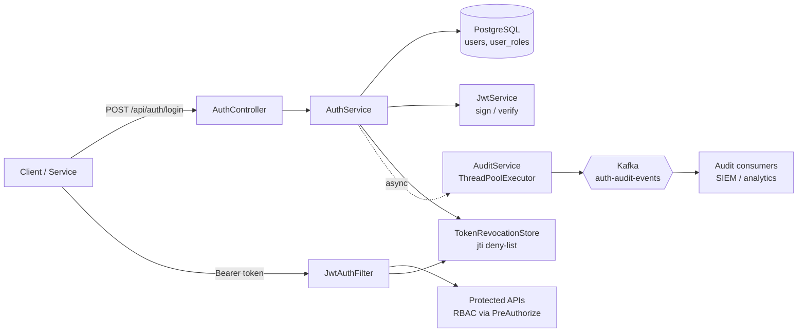
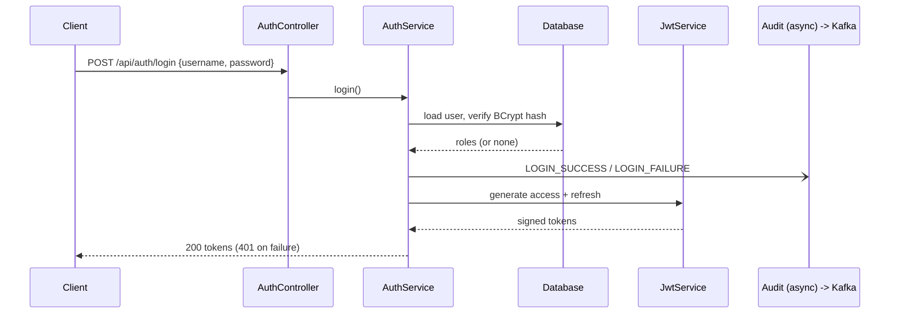

# SSO Auth Service

Centralized authentication and authorization service built with **Java 17, Spring Boot 3, Spring Security, JWT, Kafka and PostgreSQL**.
A clean-room demo of the pattern behind enterprise SSO platforms: stateless tokens, refresh rotation, RBAC and an event-driven audit trail.

> Built from scratch with demo data only. No proprietary code or client information.

## Features
- **JWT access + refresh tokens** (HS256), refresh-token rotation (single use)
- **Token invalidation**: logout revokes tokens through a `jti` deny-list
- **RBAC**: `ADMIN`, `MANAGER`, `USER` enforced with `@PreAuthorize`
- **Secure password handling**: BCrypt hashes, generic login errors, timing-equalized checks for unknown users
- **Async audit pipeline**: login, logout and refresh events published to **Kafka** from a dedicated `ThreadPoolExecutor`, off the request path
- **Flyway** migrations, **H2** by default, **PostgreSQL** via profile
- **JUnit 5 + Mockito + MockMvc** tests, GitHub Actions CI, Dockerfile

## Architecture



### Login flow



## Quick start

Requires Java 17+ and Maven. No other infrastructure needed.

```bash
mvn spring-boot:run
```

### Demo credentials

| Username | Password | Role |
|---|---|---|
| `user1` | `User@123` | USER |
| `manager1` | `Manager@123` | MANAGER |
| `admin1` | `Admin@123` | ADMIN |

### Try it

```bash
# login
curl -s -X POST localhost:8080/api/auth/login -H 'Content-Type: application/json' \
  -d '{"username":"admin1","password":"Admin@123"}'

# call a protected API
curl -H "Authorization: Bearer <accessToken>" localhost:8080/api/admin/users

# rotate tokens
curl -X POST localhost:8080/api/auth/refresh -H 'Content-Type: application/json' \
  -d '{"refreshToken":"<refreshToken>"}'

# logout (revokes the token)
curl -X POST -H "Authorization: Bearer <accessToken>" localhost:8080/api/auth/logout
```

## API

| Method | Path | Access |
|---|---|---|
| POST | `/api/auth/login` | public |
| POST | `/api/auth/refresh` | public (valid refresh token) |
| POST | `/api/auth/logout` | authenticated |
| GET | `/api/me` | any authenticated user |
| GET | `/api/manager/reports` | MANAGER, ADMIN |
| GET | `/api/admin/users` | ADMIN |

## Run with PostgreSQL + Kafka

```bash
docker compose up -d
mvn spring-boot:run -Dspring-boot.run.profiles=postgres,kafka
```

Watch audit events:

```bash
docker compose exec kafka /opt/kafka/bin/kafka-console-consumer.sh \
  --bootstrap-server localhost:9092 --topic auth-audit-events --from-beginning
```

Without the `kafka` profile, audit events are logged instead.

## Tests

```bash
mvn verify
```

- `JwtServiceTest`: round trip, expiry, tampering
- `AuthServiceTest`: Mockito unit tests for login success, unknown user, wrong password, and auditing
- `AuthFlowIntegrationTest`: login, 401/403/400 paths, RBAC matrix, logout revocation, refresh rotation, access-vs-refresh token misuse

## Design decisions
- **Stateless sessions**: no server session; identity and roles travel in a signed JWT.
- **Token typing**: `type` claim stops a refresh token being used as an access token and vice versa.
- **Refresh rotation**: each refresh token works once; replay returns 401.
- **Generic login errors**: same `Invalid credentials` message for unknown user and wrong password, to avoid user enumeration. A dummy BCrypt check for unknown users keeps response time similar.
- **Async audit**: Kafka latency or outage never slows or fails a login. `CallerRunsPolicy` applies back-pressure instead of dropping events.
- **Pluggable audit sink**: `AuditPublisher` is an interface with Kafka and logging implementations, switched by Spring profile.

## Production hardening (intentionally out of scope for the demo)
- Move `TokenRevocationStore` to Redis for multi-instance deployments
- Asymmetric signing (RS256) with key rotation and a JWKS endpoint; secrets from a vault, not config
- Rate limiting and account lockout on login
- OTP / MFA step
- Refresh-token reuse detection (revoke the whole token family)
- HTTPS only, structured logging, metrics

## Project layout

```
config/      security, async executor, JWT properties
auth/        login, refresh, logout (controller, service, DTOs)
security/    JwtService, JwtAuthFilter, TokenRevocationStore
audit/       AuditService, Kafka and logging publishers
domain/ repo/ api/   entities, repositories, protected demo endpoints
```

